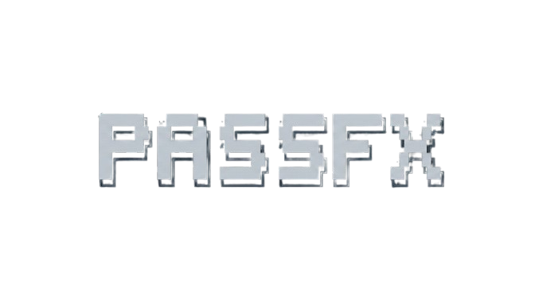

<div align="center">



**Your secrets. Your terminal. Offline by design.**

[](https://github.com/dinesh-git17/passfx/actions/workflows/code-quality.yml)
[](https://codecov.io/gh/dinesh-git17/passfx)
[](https://www.python.org/downloads/)
[](LICENSE)
[](https://github.com/psf/black)

</div>

---

## 🔐 What is PassFX?

**PassFX** is a production-grade, terminal-based password manager (TUI) built for developers who trust code more than clouds (and certainly more than they trust "free tier" SaaS).

It provides a modern, keyboard-centric interface for managing your most sensitive data—passwords, credit cards, recovery codes, and environment variables—without ever sending a single byte over the network. It combines the usability of a GUI with the speed and security of the command line.

> **Note:** PassFX is currently in Beta. It is stable enough for daily use, but as with all security tools, please maintain backups of your recovery keys.

## 🛡️ Security Philosophy

We take a paranoid, "local-first" approach to security. For a deep dive into our threat model, read our [Security Policy](SECURITY.md).

- **Offline Only:** No servers. No syncing. No "cloud backup." Because there is no cloud, only other people's computers.
- **Zero Knowledge:** We cannot see your data. If you lose your master password, your data is mathematically irretrievable.
- **Standard Primitives:** We do not roll our own crypto (rule #1 of crypto club).
  - **Encryption:** Fernet authenticated encryption (AES-128-CBC + HMAC-SHA256).
  - **Key Derivation:** PBKDF2-HMAC-SHA256 (480,000 iterations, exceeding OWASP 2023 recommendations).
  - **Randomness:** All secrets are generated using Python's `secrets` module (CSPRNG), never `random`.
- **Memory Hygiene:** We employ best-effort memory wiping for sensitive keys and implement strict auto-lock timeouts.

## ⚙️ Features

- **🖥️ Modern TUI:** Built on [Textual](https://textual.textualize.io/), featuring full mouse support, modal dialogs, and layouts that actually center the div.
- **🗃️ Versatile Storage:**
  - **Credentials:** Email/Password combinations.
  - **Financial:** Credit card details (PAN, CVV, PIN).
  - **DevOps:** Environment variables and API keys.
  - **Recovery:** 2FA backup codes.
  - **Notes:** Encrypted free-text notes.
- **⚡ Clipboard Hygiene:** Automatic clipboard clearing after 30 seconds to prevent you from accidentally pasting your password into Slack.
- **🎲 Secure Generator:** Robust generator for passwords, passphrases (XKCD-style), and PINs.
- **📊 Strength Meter:** Integrated `zxcvbn` estimation to reject "password123" before you even try to save it.
- **📤 Portable:** Full JSON/CSV export and import capabilities (encrypted export coming soon).

## 🚀 Installation

PassFX requires Python 3.10 or higher.

### From PyPI (Recommended)

```bash
pip install passfx
```

### From Source

```bash
git clone [https://github.com/dinesh-git17/passfx.git](https://github.com/dinesh-git17/passfx.git)
cd passfx
pip install -e .
```

## 🕹️ Usage

Once installed, simply run:

```bash
passfx
```

📖 **Full Manual:** For detailed instructions on recovery codes, environment variables, and drag-and-drop features, consult the **[User Guide](docs/USER_GUIDE.md)**.

### First Run

1.  You will be prompted to create a **Master Password**.
2.  Make this strong. If you lose it, **we cannot recover your data**.
3.  The vault is initialized at `~/.passfx/vault.enc`.

### Navigation

- **`TAB` / `Shift+TAB`**: Navigate between fields.
- **`Enter`**: Select or submit.
- **`Esc`**: Go back or close modals.
- **`q`**: Quit the application immediately (auto-locks vault).

## 🧪 Development & Tooling

We treat this project like mission-critical infrastructure. Our development workflow utilizes a modern `pyproject.toml` configuration and enforces strict quality gates:

- **Formatting:** Enforced by `black` and `isort`.
- **Linting:** `pylint` configuration requires a perfect **10.0/10** score. Code with smells does not merge.
- **Pre-commit:** We provide a comprehensive `.pre-commit-config.yaml`.
- **Attribution Guard:** Our CI pipeline includes a custom scanner (`scripts/attribution_guard.py`) to ensure the codebase remains clean of accidental AI/LLM attribution headers or watermarks.

### Setting up a Dev Environment

```bash
# Install the project in editable mode (dependencies from pyproject.toml)
pip install -e .

# Install development tooling
pip install black pylint isort pre-commit

# Install pre-commit hooks (Mandatory)
pre-commit install

# Run the test suite
pytest
```

## 🧠 Design Decisions

**Why Textual?**
Most terminal password managers use `curses` or `urwid`. We chose `Textual` because it allows for a CSS-driven layout engine, making the UI easier to audit and significantly more responsive. Plus, it looks better than `vim` on a bad day.

**Why Separate Salt?**
Your vault's cryptographic salt is stored in `~/.passfx/salt`, separate from the encrypted payload `~/.passfx/vault.enc`. This architectural choice adds a layer of complexity for attackers attempting to brute-force a stolen vault file without the accompanying local environment.

👉 **Deep Dive:** Read the full **[Architecture Document](docs/ARCHITECTURE.md)** for a breakdown of our crypto boundaries and data flow.

## 🤝 Contributing

We welcome contributions from security-conscious developers.

1.  Read **[CONTRIBUTING.md](docs/CONTRIBUTING.md)** for our strict quality gates.
2.  Review our **[Code of Conduct](CODE_OF_CONDUCT.md)**.
3.  🤖 **AI Users:** If you use an LLM to assist with coding, you **MUST** prompt it to read **[CLAUDE.md](CLAUDE.md)** first.

**Note:** All PRs must pass the "Quality Gate" CI workflow, which includes formatting, strict linting, and the attribution guard.

## 🧩 FAQ

**Q: Is this safer than storing passwords in a browser?**
A: Browsers are huge attack surfaces that connect to the internet. PassFX is a small, focused tool that doesn't know how to make a network request. You do the math.

**Q: Where is my data stored?**
A: On your hard drive. Specifically `~/.passfx/`. It works on my machine, and it stays on yours.

**Q: I forgot my Master Password. Can you reset it?**
A: No. We hash it more times than you've pushed to `main` on a Friday. The encryption uses industry-standard Fernet (AES-128-CBC with HMAC-SHA256), which is NIST-approved and computationally secure. Unless you have a few million years and a supercomputer, that data is gone.

**Q: Why "PassFX"?**
A: Because "PasswordManagerForTerminalWrittenInPythonUsingTextual" was rejected by PyPI for being too verbose.

---

<div align="center">
  <sub>Built with 🔒 and ☕ by Dinesh.</sub>
</div>
