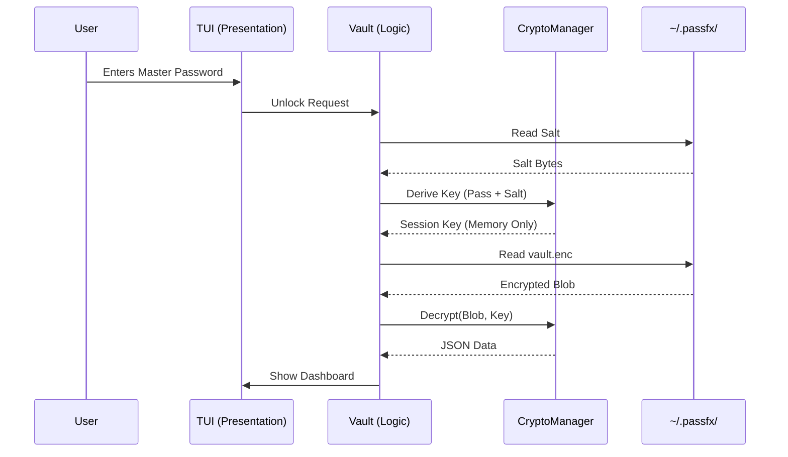

# PassFX Architecture

> "If secrets were pets, PassFX is the house cat that never leaves the apartment."

## 1. High-Level Overview

PassFX is a terminal-based password manager (TUI) designed with a singular philosophy: **Paranoia is a virtue.**

Unlike cloud-based managers that sync your most sensitive data across the hostile internet, PassFX is strictly **local-first** and **offline-only**. It leverages modern Python tooling ([Textual](https://textual.textualize.io/)) to provide a user experience that doesn't feel like you're hacking a mainframe in 1985, while ensuring cryptographic security that would make a math PhD nod in approval.

### The Mental Model

Think of PassFX as a digital safebox located inside your user directory (`~/.passfx`).

1.  **The Key:** Your master password (which we never store).
2.  **The Lock:** PBKDF2 key derivation.
3.  **The Walls:** AES-256-CBC encryption.
4.  **The Contents:** JSON data loaded into memory only when the safe is open.

---

## 2. System Components

The architecture is layered to separate **presentation** (UI) from **persistence** (Vault) and **protection** (Crypto).

### 🖥️ The Presentation Layer (`passfx/app.py` & `passfx/screens/`)

Built on the **Textual** framework. This layer handles the event loop, input processing, and rendering.

- **`PassFXApp`**: The puppet master. It manages the screen stack and holds the reference to the `Vault` instance.
- **Screens**: Individual UI contexts (e.g., `LoginScreen`, `PasswordsScreen`). They are ephemeral views into the data.

### 🧠 The Logic Layer (`passfx/core/vault.py`)

The `Vault` class is the data controller. It acts as the bridge between the encrypted disk storage and the Python objects used by the UI.

- Responsible for **CRUD operations** (Create, Read, Update, Delete).
- Manages the **auto-lock timer**.
- Handles **serialization** (JSON <-> Python Objects).

### 🛡️ The Security Kernel (`passfx/core/crypto.py`)

The `CryptoManager` is the most critical component. It is a **Zero-Knowledge** module.

- **Responsibility:** It handles all encryption, decryption, and key derivation.
- **Isolation:** The `Vault` class gives it bytes; `CryptoManager` returns bytes. The `Vault` never sees the raw key, and `CryptoManager` never cares about the JSON structure.

### 💾 The Storage Layer

- **`~/.passfx/vault.enc`**: The encrypted blob containing your credentials.
- **`~/.passfx/salt`**: The random salt used for key derivation. Stored separately to enforce structure and slightly annoy attackers who only steal one file.

---

## 3. Data Flow: The Secret Life of a Secret

This is the most critical section. Here is exactly how data moves through the system.

### A. Unlocking the Vault

1.  User inputs **Master Password**.
2.  `CryptoManager` reads the **Salt** from disk.
3.  **Key Derivation:** We run the password + salt through **PBKDF2-HMAC-SHA256** (480,000 iterations). This burns CPU cycles to make brute-forcing expensive.
4.  **Decryption:** The derived key opens the `vault.enc` file via **Fernet** (AES-256-CBC).
5.  **Inflation:** The decrypted JSON bytes are parsed into Python objects (`EmailCredential`, etc.) and reside in **System RAM**.

### B. Saving a Credential

1.  User types "hunter2" into the UI (please don't).
2.  Data is stored in a Python object in RAM.
3.  **Serialization:** `Vault` dumps all objects to a JSON string.
4.  **Encryption:** `CryptoManager` encrypts the JSON bytes with the session key.
5.  **Persistence:** `Vault` overwrites `vault.enc` on disk.

### C. Locking / Quitting

1.  **Memory Wipe:** The `Vault` drops references to the data objects.
2.  **Key Destruction:** `CryptoManager` attempts to overwrite the key in memory with random garbage before deletion.
    - _Note:_ Python's garbage collector makes a "perfect" wipe difficult, but we make a best-effort attempt to prevent memory scraping.

> **Crucial:** Your unencrypted secrets exist in **RAM** while the vault is unlocked. They never touch the disk in plaintext.

---

## 4. Security Boundaries & Threat Model

We can't protect you from everything. Here is the honest breakdown.

### ✅ What we protect against:

- **Disk Theft:** If someone steals your laptop, they cannot read your vault without the master password.
- **Casual Snooping:** The file format is opaque binary.
- **Network Attacks:** We don't have network code. You can't hack a port that isn't open.
- **Shoulder Surfing:** Passwords are masked (`*******`) by default in the UI.

### ❌ What we do NOT protect against:

- **Keyloggers:** If your machine is compromised with malware, they can capture your master password as you type it. Game over.
- **Memory Dumps:** A sophisticated attacker with root access _while PassFX is running and unlocked_ could theoretically scrape RAM.
- **Social Engineering:** If you tell someone your master password, math cannot save you.
- **The "$5 Wrench" Attack:** Physical coercion bypasses all encryption.

---

## 5. Design Decisions & Trade-offs

### Why Textual?

Most terminal apps use `curses`. Curses is... "vintage." We chose **Textual** because it offers a modern CSS-driven layout engine. This makes the codebase cleaner, easier to audit, and reduces the chance of UI bugs leaking data (e.g., drawing a password where a label should be).

### Why PBKDF2 instead of Argon2?

Argon2 is the modern gold standard, but `cryptography` (our upstream dependency) has first-class, battery-included support for PBKDF2/Fernet. We prioritize **standard, well-audited primitives** over bleeding-edge complexity. 480k iterations of PBKDF2 is sufficient for our threat model.

### Why separate the Salt?

We store the salt in `~/.passfx/salt` and the data in `~/.passfx/vault.enc`.

- **Pros:** Ideally, an attacker needs _both_ files to begin a brute-force attack effectively.
- **Cons:** You need to backup both files.
- **Verdict:** It enforces a clean separation of cryptographic parameters and payload.

---

## 6. Tooling & Enforcement

Architecture is nothing without enforcement. We treat our build pipeline as a production component.

- **The Quality Gate:** CI requires a **10.0/10** Pylint score. We do not allow "technical debt" commits.
- **Attribution Guard:** A custom script (`scripts/attribution_guard.py`) scans the codebase to ensure no AI-generated "watermarks" or attribution headers accidentally slip into the source. We want _your_ code, not a chatbot's copy-paste.
- **Type Safety:** Python 3.10+ type hinting is mandatory.

---

## 7. Extensibility & Maintenance

### Where to Extend

- **New Credential Types:** Add a model in `core/models.py` and a screen in `screens/`. The `Vault` handles serialization generically, so storage comes for free.
- **Exporters:** The `utils/io.py` module is designed to be pluggable for new formats (XML? YAML? Go wild).

### "Here Be Dragons" 🐉

- **`core/crypto.py`**: Do not touch this unless you know exactly what you are doing. If you break the KDF or encryption logic, user data becomes unrecoverable digital noise.

---

_Document maintained by the PassFX Engineering Team._
